# 💼 JobTrack

**JobTrack** is a modern mobile application designed to help job seekers organize and manage their entire job search from one place.

Users can track applications, manage interviews and tasks, monitor their progress, store career documents, and use AI-powered tools to improve their job search and interview preparation.

## ✨ Key Features

- 📋 **Application Tracking** — Manage job applications from Saved to Offer or Rejected
- 📊 **Smart Dashboard** — View applications, interviews, tasks, goals, and recent activity
- 🗂️ **Kanban Pipeline** — Organize applications by recruitment stage
- 📅 **Interview Management** — Track upcoming interviews and preparation
- 📄 **Resume Analyzer** — Analyze resumes and receive AI-powered feedback
- 🎯 **Job Match** — Compare a resume with a job opportunity
- ✍️ **Cover Letter Assistant** — Generate personalized cover letters
- 🤖 **Interview Coach** — Practice interview questions with AI
- 📈 **Analytics** — Visualize application activity and job-search performance
- 👤 **Career Profile** — Manage skills, target roles, preferences, and professional information
- 🔐 **Secure Authentication & Storage** — User data and documents are protected with Supabase

## 🛠️ Built With

**React Native · Expo · TypeScript · Supabase · PostgreSQL · Edge Functions · OpenAI**

## 📱 Screenshots

### Home & Applications

  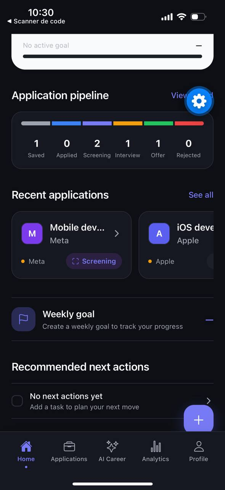
  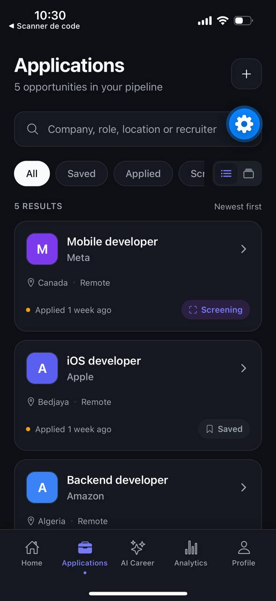
  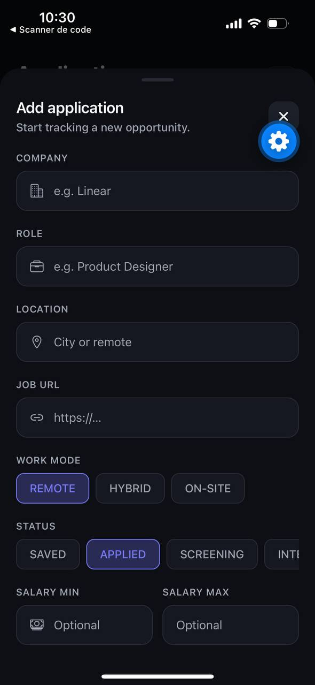

### AI Career Assistant

  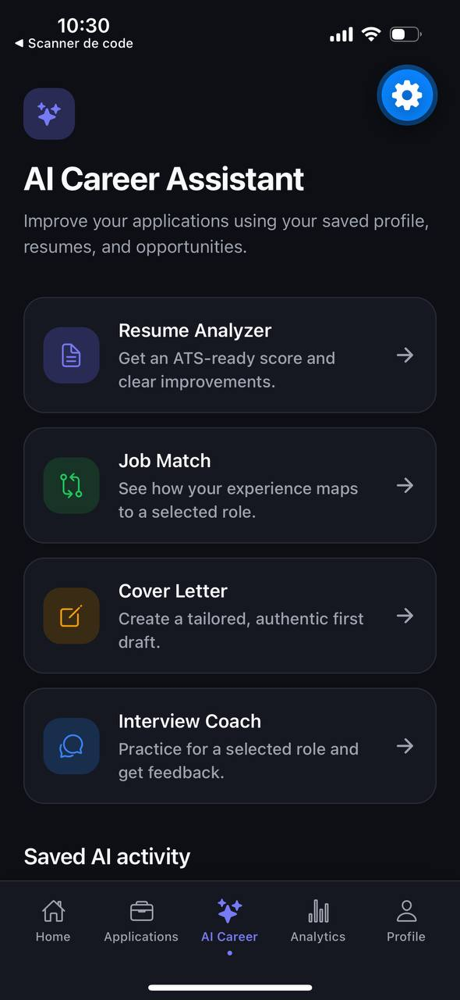
  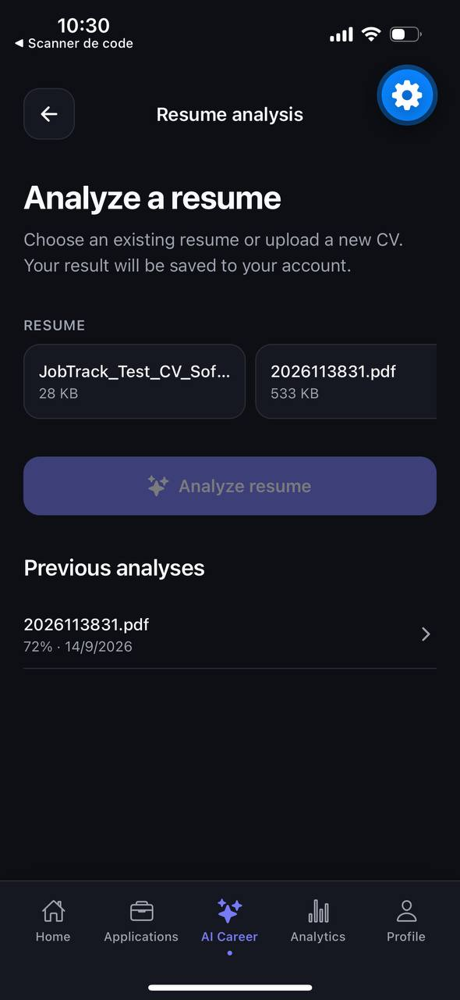
  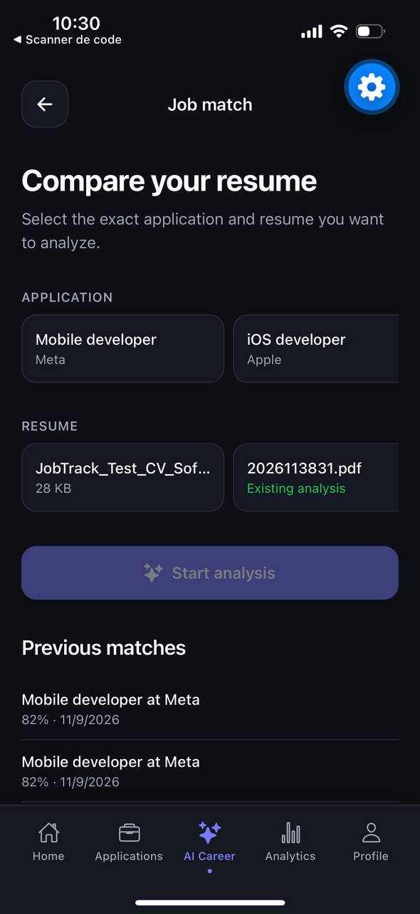

  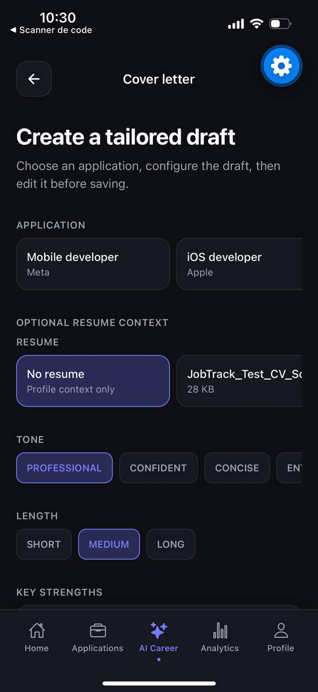
  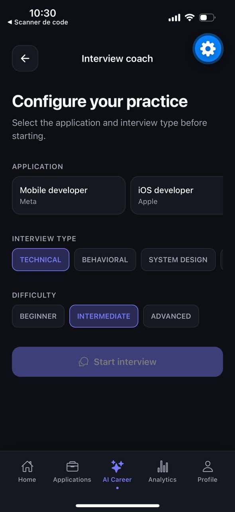

### Analytics

  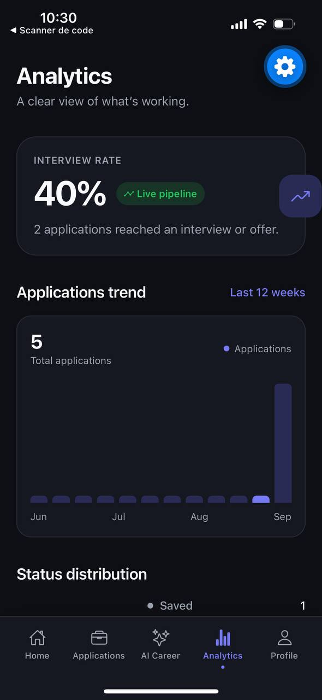
  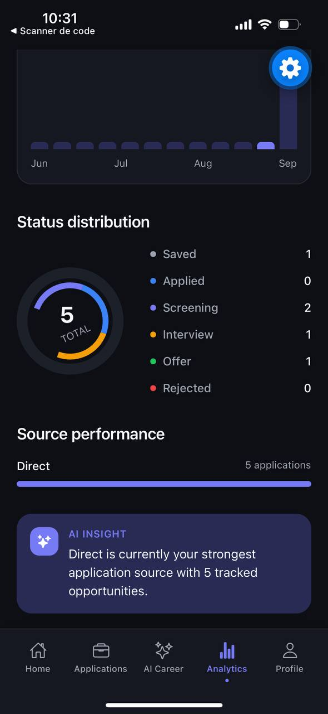

### Profile

  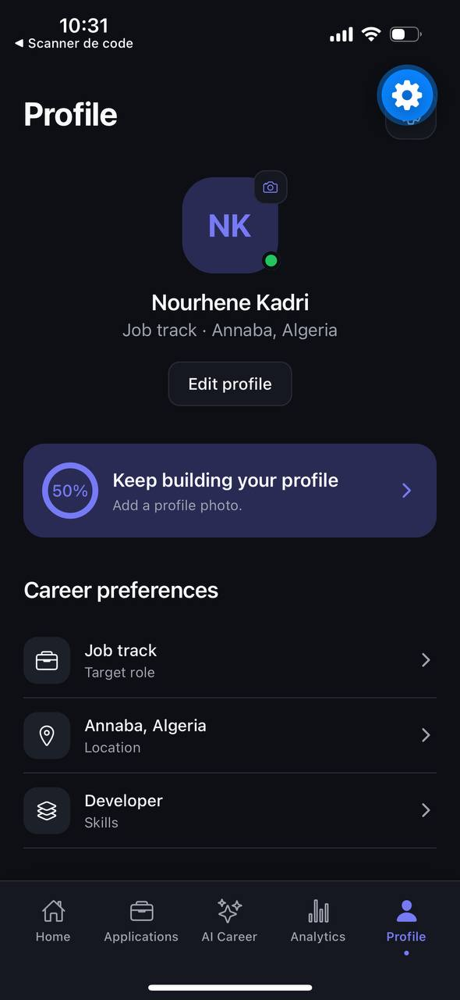
  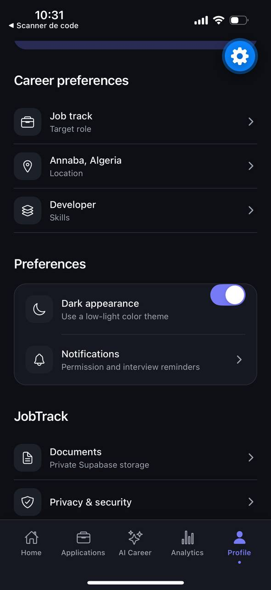

## 👩‍💻 Author

**Nourhene Kadri**

Software Developer · Full-Stack Developer · Mobile & Web Developer